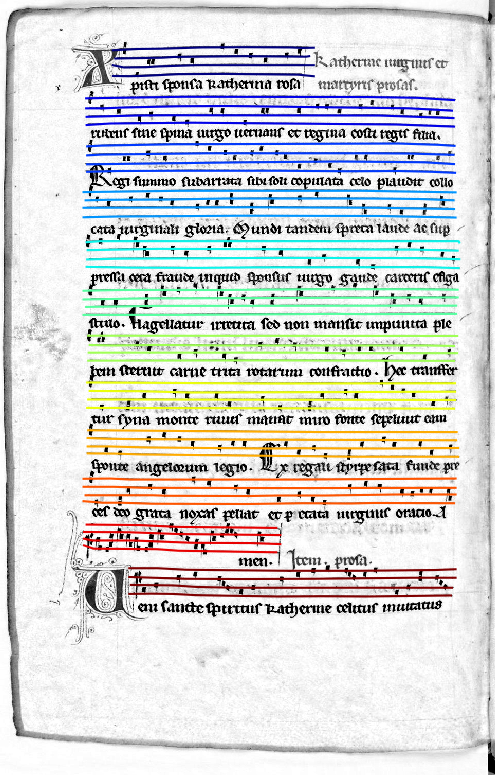

#Line Detection on historical handwritten documents

Line segmentation algorithms for the OMMR4all project, originally created by Alexander Hartelt.

## Prerequisites
Dependencies for the project are located in requirement.txt. 
Major Dependencies are:
* Pixel classifier (CWick: https://gitlab2.informatik.uni-wuerzburg.de/chw71yx/page-segmentation)
* numpy
* tensorflow
* scipy
* pillow
* opencv

## Installing

This projects requires the pixel classifier of
https://gitlab2.informatik.uni-wuerzburg.de/chw71yx/page-segmentation
to be installed locally.
 * Clone the page segmentation repository `git clone https://gitlab2.informatik.uni-wuerzburg.de/chw71yx/page-segmentation`
 * (Optional but recommended) Activate your virtual environment 
   (adapt to your path): `source venv/bin/activate`
 * install page segmentation `cd page-segmentation && python setup.py install`
 * the line detection is installed
 * install the specific requirements of line detection `cd ommr4all-line-detection && pip install -r requirements.txt`

 
 ## Command line interface
 
 If you simply want to use the tool to your images you can use the scripts provided by the tool.
 
 Note that you have to activate the virtual environment if used during the installation in order to make the command line scripts available.
 You can segment the staff lnes in the image by calling:
 
 `line-segmentation-predict --gray your_gray_scale_images.*.png`
 
Note that there are several important and optional parameters to adjust and enhance the prediction.

For a full list type `line-segmentation-predictit --help` 

## Example

input             |  Predicted Lines
:-------------------------:|:-------------------------:|
 | 
 
 ## Authors
 * Alexander Hartelt
 * Christoph Wick
 